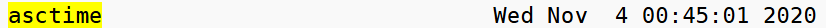

## asctime

---

### 函数原型

```C++
char* asctime( const std::tm* time_ptr );
```

- tm 具体查看
[tm](./tm.md)

### 使用示例

```C++
const std::time_t now = std::time(nullptr);
std::cout << std::setw(40) << "asctime" << std::asctime(std::localtime(&now));
```

