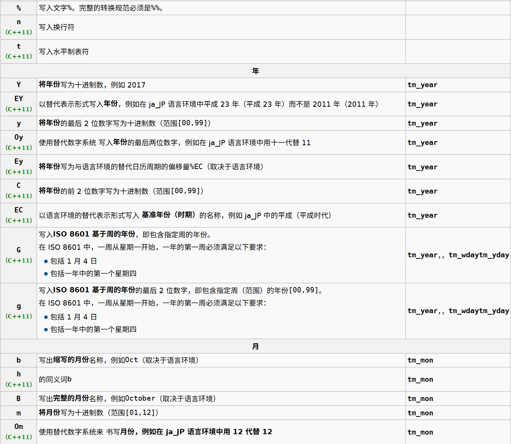

## put_time 格式化输出时间 tm*

--- 
### 函数模型

```C++
template< class CharT >
/*unspecified*/ put_time( const std::tm* tmb, const CharT* fmt );

```

- tm [tm](../ctime/tm.md)
- charT 格式化输出
- 返回一个 std::ostream 对象

### 推荐
```C++
std::put_time(&info, "%Y-%m-%d %H:%M:%S")
```

### charT 格式化



